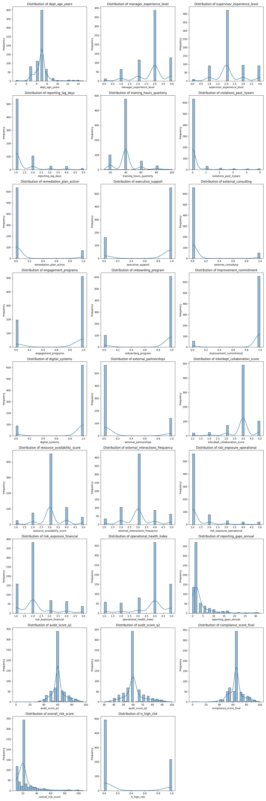
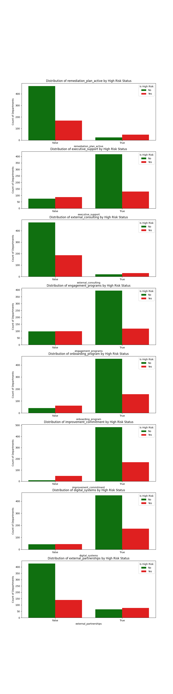
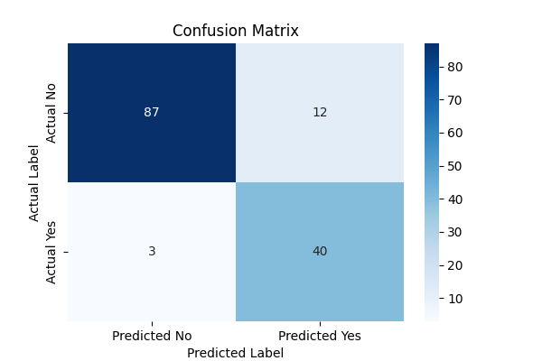
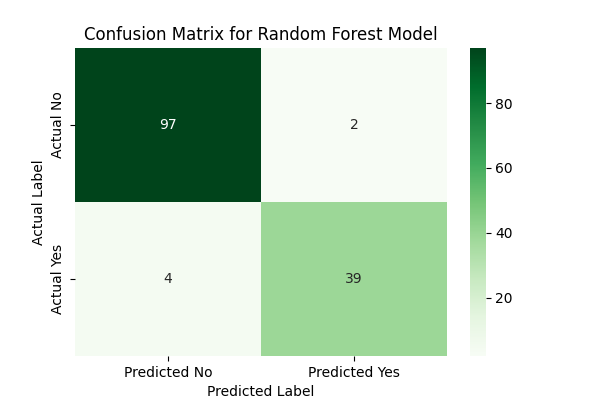

# 📘 **Compliance Radar — Organizational Risk & Integrity Analysis**

### *Machine Learning for Corporate Compliance Monitoring*

**Team Members:**
Cesar Dushimimana, Student 2, Student 3, Student 4
Bachelor’s in Artificial Intelligence & Management — Luiss Guido Carli University

---

# **1. Introduction**

This project develops a machine-learning system to identify organizational departments with elevated compliance risk. Using the `org_compliance_data.db` database, which contains detailed operational, managerial, audit, reporting, and engagement information, departments are classified as either *high-risk* or *not high-risk*.

Beyond prediction, the project emphasizes interpretability and responsible AI. The objective is to provide compliance officers and governance teams with an early-warning decision-support tool that highlights key drivers of risk while ensuring transparency, accountability, and ethical use of machine learning in compliance contexts.

---

# **2. Methods**

## **2.1 Problem Formulation**

The task is formulated as a binary classification problem. The target variable, `is_high_risk`, equals 1 for departments listed in the `high_risk_departments` table and 0 otherwise. The goal is to learn which organizational, managerial, and operational factors are associated with increased compliance risk, with particular emphasis on minimizing false negatives.

---

## **2.2 Dataset Description**

The dataset is stored in a relational database composed of four tables. The primary table, **departments**, contains **709 observations and 37 attributes**, describing:

* organizational structure and function
* managerial and supervisory experience
* audit outcomes and compliance scores
* violations and remediation activity
* reporting behavior and engagement indicators
* operational and financial risk exposure

The `dept_id` identifier is retained exclusively for reporting, grouping, and interpretability purposes and is not used as a predictive feature.

---

## **2.3 Data Cleaning and Integrity Resolution**

Data integrity checks revealed duplicate `dept_id` values with conflicting attributes. These observations were retained, as they represent meaningful organizational inconsistencies rather than data errors. Missing values were handled as follows:

* Numerical features were imputed using the median.
* Categorical features were imputed using the most frequent category.
* No observations were removed, preserving dataset completeness and class distribution.

---

## **2.4 Feature Engineering**

Feature engineering focused on preserving semantic meaning while ensuring model compatibility:

* The `is_high_risk` target variable was constructed from the high-risk department list.
* Strictly binary-like features were converted to Boolean type.
* Mixed binary-like features were treated as categorical variables.
* Ordinal experience variables (`manager_experience_level`, `supervisor_experience_level`) were retained as ordered numeric variables (0–4).
* Rating-scale variables (1–5 operational and collaboration scores) were preserved as ordered numeric features.
* The `dept_id` field was excluded from all modeling steps.

---

## **2.5 Modelling Strategy**

To balance interpretability and predictive performance, the following models were implemented:

* Majority Class Baseline
* Logistic Regression
* Random Forest
* XGBoost

Logistic Regression serves as a transparent baseline model, while tree-based models capture non-linear relationships and interaction effects relevant to compliance risk.

---

## **2.6 Preprocessing Pipeline**

Completed preprocessing steps include:

* Missing value imputation.
* Validation and conversion of binary-like features.
* Verification of ordinal and rating-scale variables.
* Distributional analysis of all numerical features.
* Outlier identification using histograms and boxplots.
* Identification of categorical variables for encoding.
* Exclusion of `dept_id` from preprocessing and modeling.

Exploratory visualizations:

* **Numeric feature distributions**
  ``

* **Boolean feature distributions by risk status**

---

## **2.7 Environment Reproducibility**

The repository includes environment configuration files and a structured directory layout (`data/`, `notebooks/`, `images/`, `reports/`) to ensure full reproducibility of all experiments and results.

---

## **2.8 System Diagram**

A system-level workflow diagram summarizes the process  through preprocessifrom loading data from the database file, modeling, evaluation, and interpretation:

---

# **3. Experimental Design**

Models are evaluated using metrics appropriate for imbalanced classification and compliance risk detection:

* Accuracy
* Precision
* Recall
* F1-score
* ROC-AUC

Stratified train-test splitting preserves class proportions. Hyperparameter tuning is conducted via cross-validation, with recall prioritized due to the high cost of failing to identify high-risk departments.

---

# **4. Results**

Results show clear performance differences across models:

* **Logistic Regression** achieves high recall for high-risk departments, minimizing false negatives but producing more false positives.
* **Random Forest** provides the strongest overall performance, maintaining high recall while substantially improving precision and reducing false alarms.
* Feature importance and coefficient analysis identify violations, operational risk exposure, audit outcomes, and organizational instability as the most influential risk drivers.

Result visualizations:

``
``
``
``

---

# **5. Conclusions**

## **5.1 General Conclusions**

This project demonstrates that machine learning can effectively support organizational compliance monitoring. While Logistic Regression offers strong interpretability, Random Forest achieves a superior balance between recall and precision, making it the preferred model in a compliance context where missed risks are costly. Interpretability analyses confirm that predictions are driven by meaningful compliance-related indicators.

---

## **5.2 Limitations and Future Work**

Limitations include the static nature of the dataset, potential reporting inconsistencies, and the absence of temporal dynamics. Future work may include:

* longitudinal and temporal risk modeling
* integration of unstructured audit text data
* interactive dashboards for compliance monitoring
* model drift detection and governance frameworks
* external validation on additional organizations or time periods

---

## **5.3 Ethical and Governance Considerations**

Compliance-risk prediction systems must be transparent, fair, and subject to human oversight. Model outputs are intended as decision-support tools rather than automated judgments. Interpretability techniques, including feature attribution and SHAP analysis, are employed to support responsible AI deployment and informed governance.
